# Lab7Web

## Nama: Bagus aditya hermawan
## Nim: 312410382
## Kelas: TI.24.A.3
## Mata Kuliah: Pemrograman Web 1

## 1. Install Xampp
install terlebih dahulu
###### 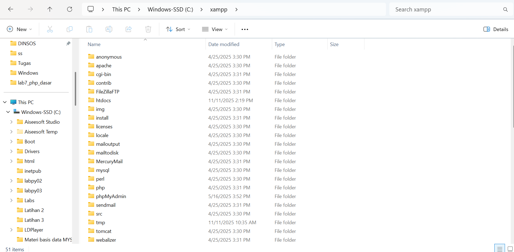

## 2. Menjalankan web server
Untuk menjalankan web server dari menu XAMPP Control.
###### 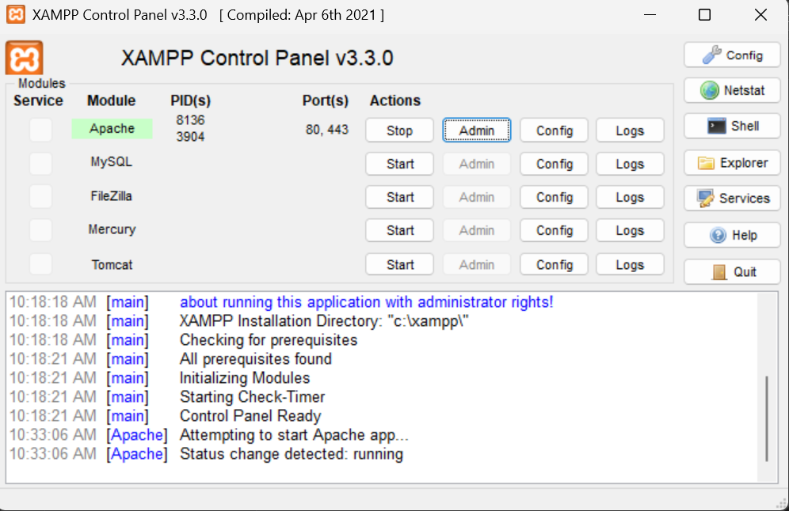
Uji coba apakah server sudah berkerja dengan baik
http://127.0.0.1 atau http://localhost
Akan tampil halaman utama XAMPP jika server sudah berkerja dengan baik.

## 3. Memulai PHP
Buat folder terlebih dahulu.
###### 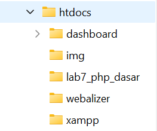
Kemudian untuk mengakses direktory tersebut pada web server dengan mengakses URL:
http://localhost/lab7_php_dasar/.
###### 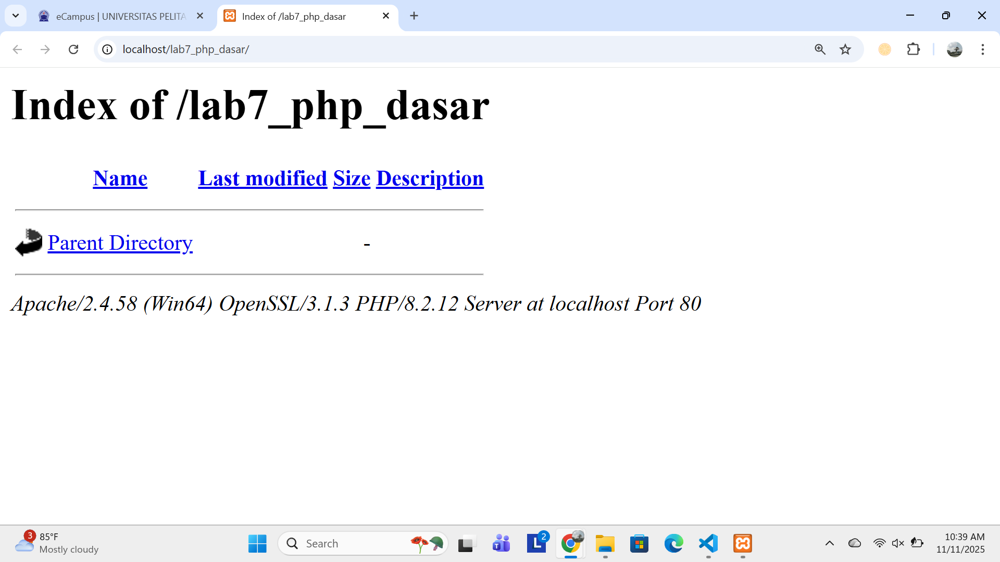

## 4. PHP dasar
Buat file baru dengan nama php_dasar.php. lalu buat kode seperti dibawah.
###### 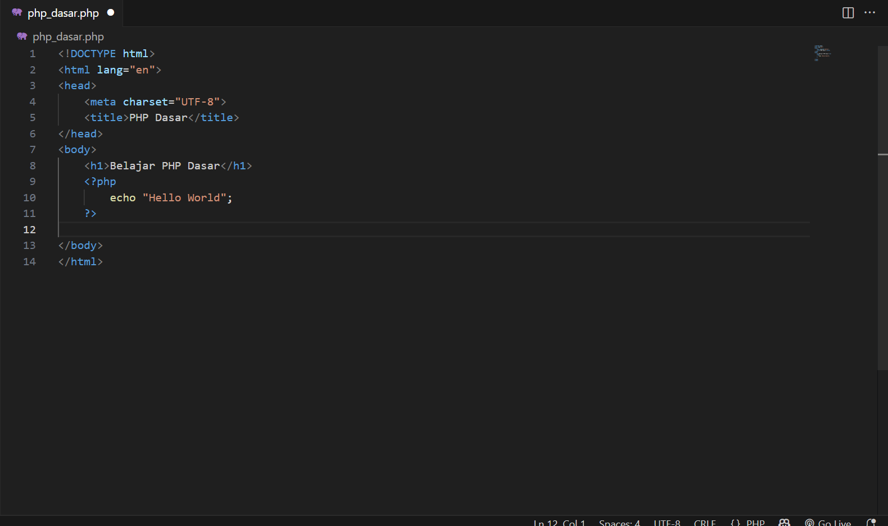
Kemudian untuk mengakses hasilnya melalui URL:
http://localhost/lab7_php_dasar/php_dasar.php
###### 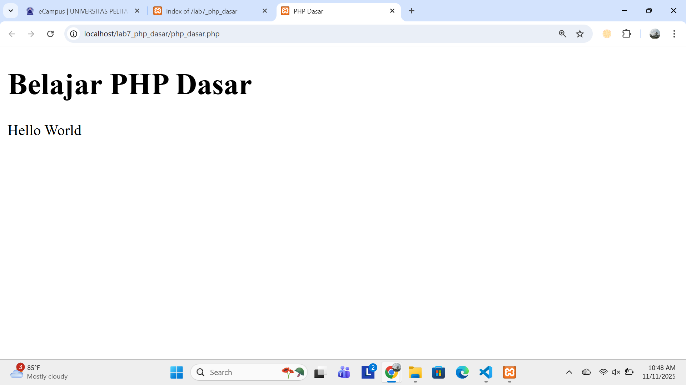

Variable PHP pada porgram.
input:
###### 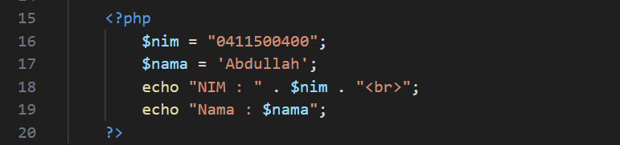
ouput:
###### 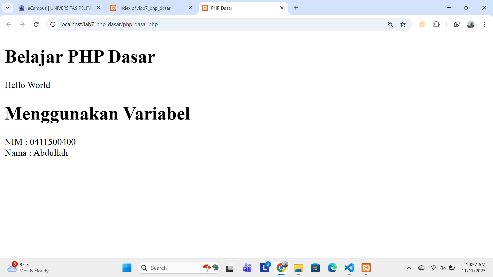

## 5. Membuat file dengan nama latihan 2
## Predefine Variable $_GET
###### 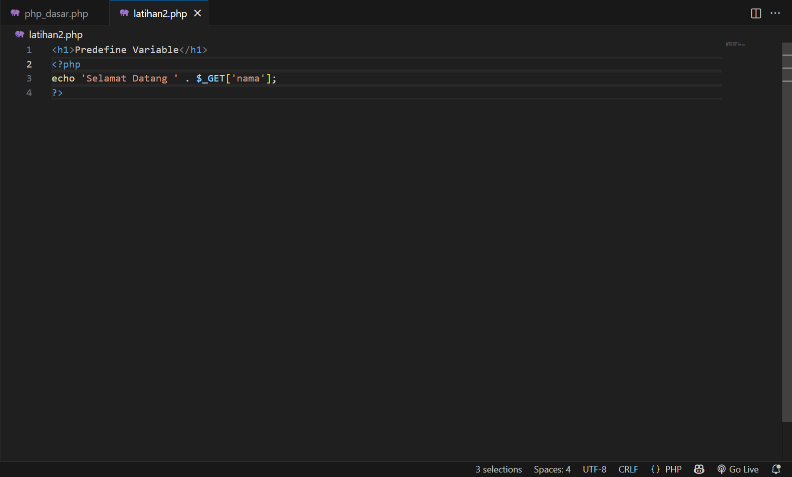

Untuk mengaksesnya gunakan URL:
http://localhost/lab7_php_dasar/latihan2.php?nama=Agung.
###### 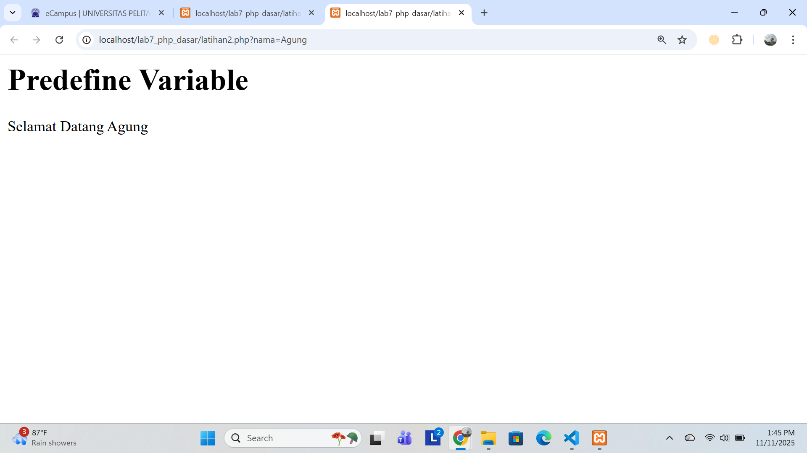

## Membuat form input
input:
###### 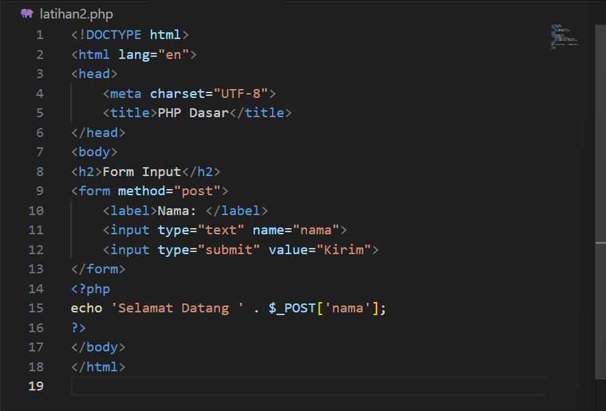
output:
###### 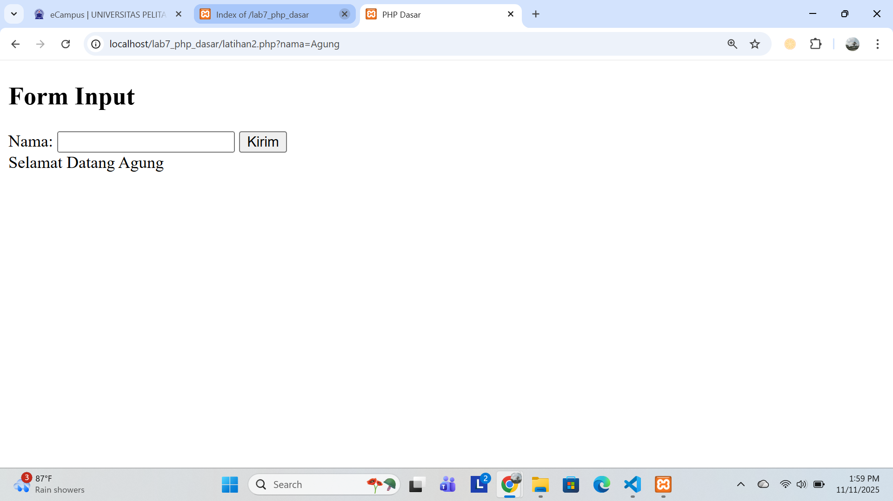

## Operator
###### 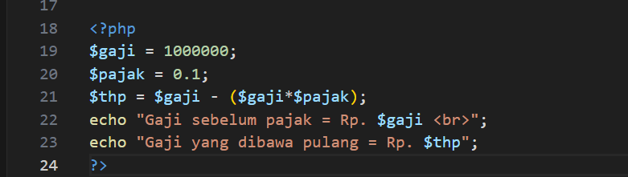

## Kondisi IF
###### 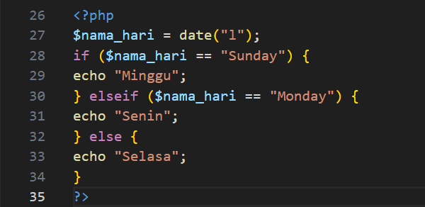

## Kondisi Switch
###### 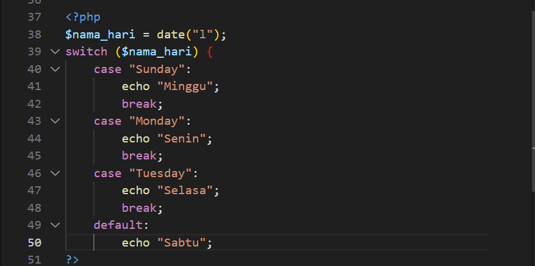

## Perulangan for
###### 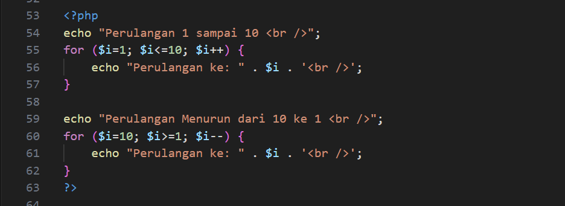

## Perulangan While
###### 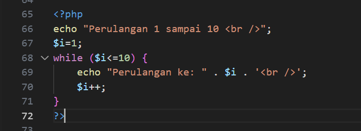

## Perulangan Dowhile
###### 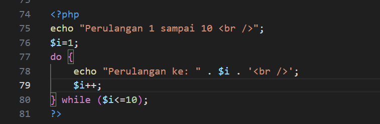